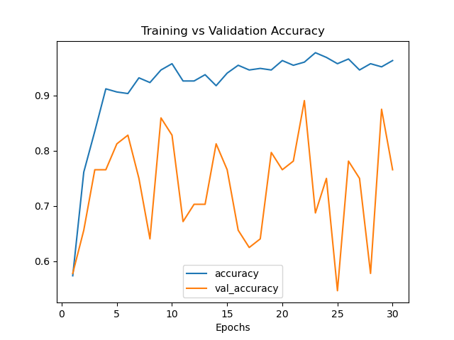
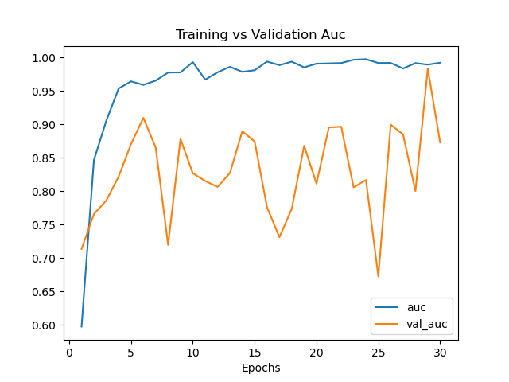
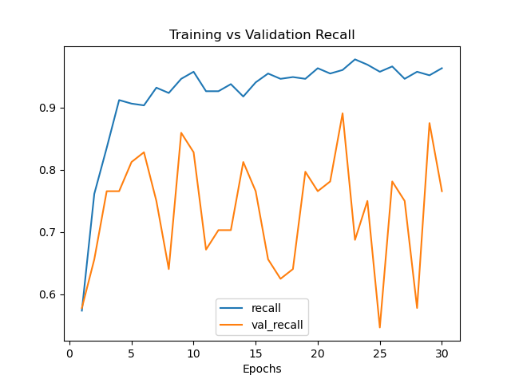
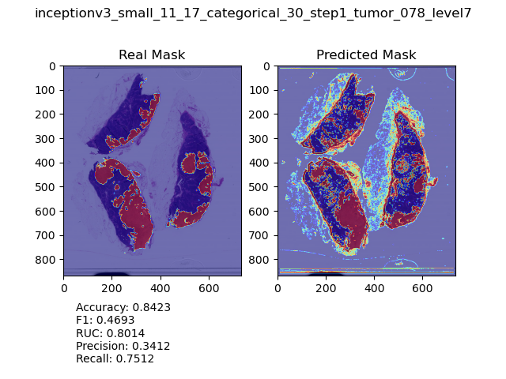
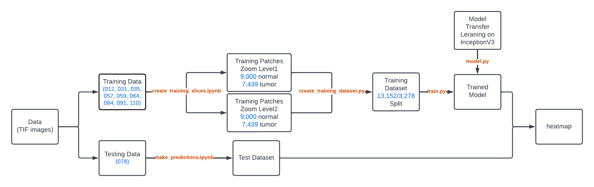
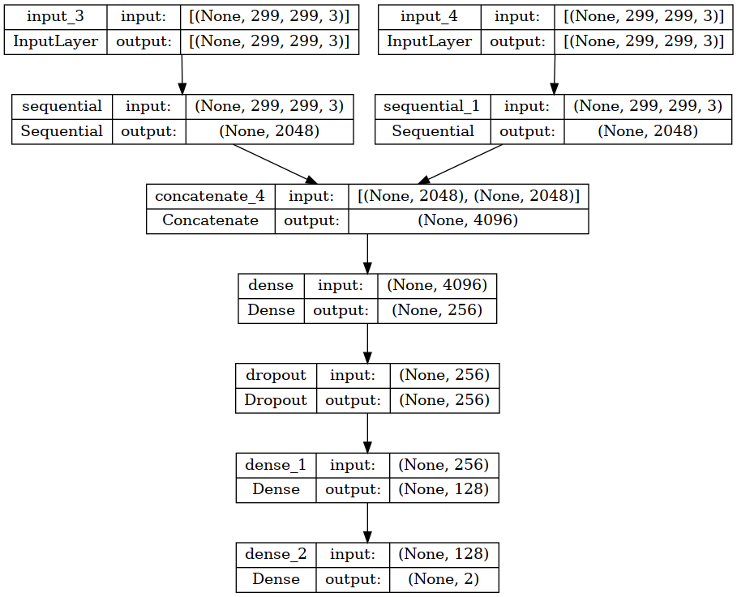

## Introduction

This project aims to create a deep learning end-to-end pipeline that helps to identify and localize cancer cells in gigapixel pathology images

* Research Paper: https://arxiv.org/abs/1703.02442
* Data: https://camelyon16.grand-challenge.org/Data/
* Youtube: https://www.youtube.com/watch?v=azWn_pX8Yrc

## How to Reproduce (High-level)

* download data to local, set up directories and environment
* `create_training_slices.ipynb`
* `validate_training_data.ipynb`
* `python train.py`
* `make_prediction.ipynb`
* `plot_history.ipynb`

## Environment

The repo is based on local development using WSL2 with a Nvidia GPU. Below is a set of hardware usage based on current repo setting. Because the project involves handling big size of data, a more capable set of hardware or using Cloud services is recommended

* Disk size: 31GB
* GPU: Nvidia GeForce 3060 Laptop
* Memory: 32GB

Software environment:

* Python: 3.9
* Virtual Env: conda with tensorflow
* System: Ubuntu 20.04

The virtual environment can be created using 
```
conda create --name <env> --file requirements.txt
```

## Summary

### Models

See `./models.py` for more details

* transfer learning in InceptionV3
* customized CNN model

The checkpoints are so large that it is unfeasible to store in github. Instead, they can be downloaded with the links

* [InceptionV3_small_30](https://drive.google.com/file/d/1zFgo7c1HrH9spK88pqwYjwRs4PGi7-SX/view?usp=share_link)

### Input Shape

The input consists of slide patches from 2 zoom levels centered
at the same place and a one-hot-encoded binary label. With a batch size 32 the input looks like

* X Shape: `(32, 299, 299, 3), (32, 299, 299, 3)`
* y Shape: `(32, 2)`

### Training Data

The training data is created from the slides and masks stored in `./TIFs/trainingTIFs/`

In this project, the training data consists of
```
>>> import find_training_data
>>> find_training_data.find_train_tif()
[('tumor_012.tif', 'tumor_012_mask.tif'), 
 ('tumor_031.tif', 'tumor_031_mask.tif'), 
 ('tumor_035.tif', 'tumor_035_mask.tif'), 
 ('tumor_057.tif', 'tumor_057_mask.tif'), 
 ('tumor_059.tif', 'tumor_059_mask.tif'), 
 ('tumor_064.tif', 'tumor_064_mask.tif'), 
 ('tumor_084.tif', 'tumor_084_mask.tif'), 
 ('tumor_091.tif', 'tumor_091_mask.tif'), 
 ('tumor_110.tif', 'tumor_110_mask.tif')]
```

In total, there are `16,439` training patches

```
❯ ls expTraining/zoom1/slides/normal/ | wc -l
9000
```

```
❯ ls expTraining/zoom1/slides/tumor/ | wc -l
7439
```

Which, after train-test split with `0.25` assigned to validation, contributes to the following training dataset

```
>>> import create_training_dataset
>>> create_training_dataset.create_train_val_dataset()
Found 13152 images belonging to 2 classes.
Found 3287 images belonging to 2 classes.
Found 13152 images belonging to 2 classes.
Found 3287 images belonging to 2 classes.
{'normal': 0, 'tumor': 1}
``` 

### Training Benchmark

Using model `checkpoints/inceptionv3_small_11_17_categorical_30.h5`






### Testing

I used tumor_078 because it has a relatively large region of tumor. Using model `inceptionv3_small_11_17_categorical_30.h5`


## Workflow



## Model Structure

The model uses transfer learning on [InceptionV3](https://keras.io/api/applications/inceptionv3/). The structure is



## Repo Structure

The structure of the repo looks like follows
```
❯ tree -d .
.
├── TIFs
│   ├── testingTIFs
│   └── trainingTIFs
├── __pycache__
├── checkpoints
├── expTraining
│   ├── zoom1
│   │   ├── masks
│   │   │   ├── normal
│   │   │   └── tumor
│   │   └── slides
│   │       ├── normal
│   │       └── tumor
│   └── zoom2
│       ├── masks
│       │   ├── normal
│       │   └── tumor
│       └── slides
│           ├── normal
│           └── tumor
├── experiment
├── history
├── notebooks
├── plots
└── predictions

25 directories
```
In above structure
* TIFs: store original TIF images
* notebooks: store jupyter notebooks
* expTraining: store training patches of slides and tumors
* checkpoints: store model checkpoints
* history: compressed model `history.history` in `.pkl` format
* plots: figures
* predictions: prediction lists in `.pkl` format

## How to Reproduce (Detailed)
<!-- 1. run `prepare_data.ipynb` on Google Colab -->
It is recommened to skim through all the python scripts and be familiar with the general structure. Specifically, it is important to understand and make sure all global variables in `utils.py` are correctly configured

### 1. Download Data to Local

download tumor slide .tif images and mask .tif images to local
drive. By default, split training slide and tumor tif images to `./TIFs/trainingTIFs/` and testing slide and tumor images to `./TIFs/testingTIFs/`

### 2. Create Training Patches

Because the original image is very large (~1GB per slide), we will follow the paper and create smaller training patches from original images. To accomodate the structure of InceptionV3, we will make patches with size `(299, 299, 3)` from 2 zoom levels of images

First, make sure all global variables in `utils.py` are set correctly, then start jupyter lab and run `create_training_slices.ipynb`

### 3. Validate Training Slices

To make sure we have created normal/tumor patches correctly on 2 different zoom levels (which is complicated!), initiate jupyter lab then open and run `validate_training_data.ipynb`

If all cells output `True` then we can proceed to the next step

### 4. Training 

If needed, modify or add model in `model.py`, then 
specify output path to save checkpoints in `train.py`, then

```
❯ python train.py
```

Which will read generator created by `./create_training_dataset.py`

### 5. Plot Heatmap and Evaluate

Initiate jupyter lab, then open and run `./make_prediction.ipynb`
the plots are saved in `./plots/`

### 6. Plot History

Initiate jupyter lab session, then open and run `./plot_history.ipynb`